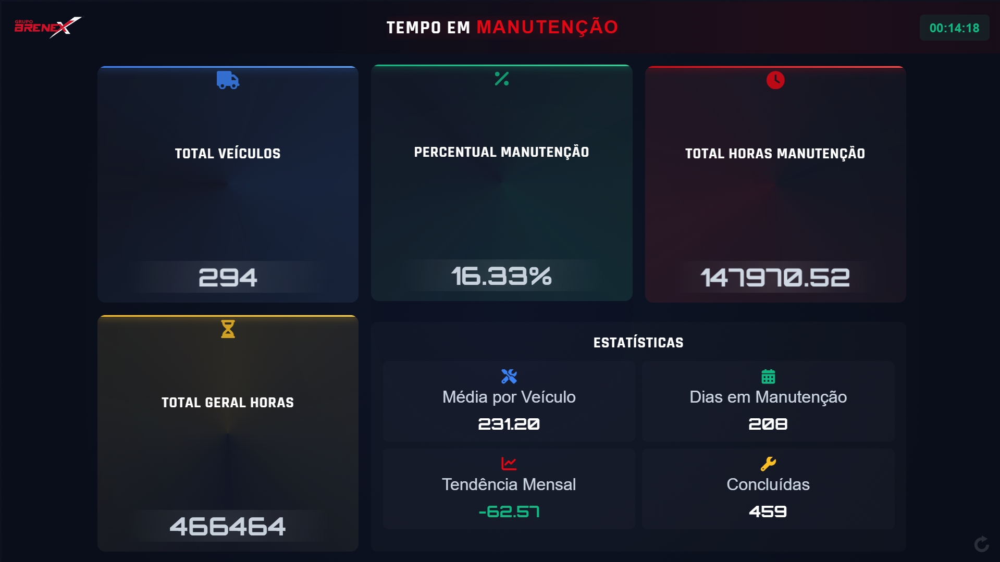

# 📱 BRENEX - FORMULÁRIO - TEMPO EM MANUTENÇÃO

> A tela se trata de um dashboard que visa mostrar o tempo em manutenção dos veículos.

---

## 📸 Visualização



---

## ✨ Funcionalidades

- [ ] **TOTAL VEICULOS:** MOSTRA A QUANTIDADE TOTAL DE VEÍCULOS QUE A QUERY BUSCOU.
- [ ] **PERCENTUAL MANUTENÇÃO:** MOSTRA O PERCENTUAL TOTAL DE VEÍCULOS EM MANUTENÇÃO.
- [ ] **TOTAL HORAS MANUTENÇÃO:** MOSTRA O TOTAL DE HORAS EM MANUTENÇÃO.
- [ ] **TOTAL GERAL DE HORAS:** MOSTRA O TOTAL DE HORAS EM MANUTENÇÃO.
- [ ] **MEDIA POR VEICULO:** MOSTRA A MEDIA DE HORAS EM MANUTENÇÃO POR VEICULO.
- [ ] **DIAS EM MANUTENÇÃO:** MOSTRA A MEDIA DE DIAS EM MANUTENÇÃO POR VEICULO.
- [ ] **TENDENCIA MENSAL:** MOSTRA A TENDENCIA MENSAL DE MANUTENÇÃO.
- [ ] **CONCLUIDOS:** MOSTRA A QUANTIDADE DE VEÍCULOS QUE FORAM CONCLUIDOS.

---

## 🛠️ Tecnologias e Ferramentas

Para o desenvolvimento desta tela, utilizei as seguintes tecnologias:

* **MARCAÇÃO:** [HTML]
* **ESTILIZAÇÃO:** [CSS]
* **BANCO DE DADOS:** [SQL]
* **LATROMI:** [SOFTWARE]

---

## 🏗️ Estrutura de Pastas (Opcional)

```text
brenex-tempo-manutencao/
     ├── index.html       # Componente principal
        └── CSS          # Utilizado com a tag <style> dentro do HTML.
    ├── base-query-agregada-v2.sql # Query que foi usada para buscar os dados
    ├── logo.svg         # Logo do Brenex
    ├── README.md        # Documentação
    └── tela.png         # Imagem do Dashboard